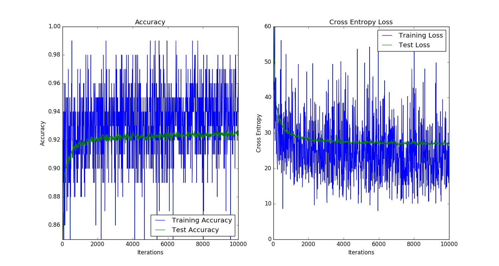
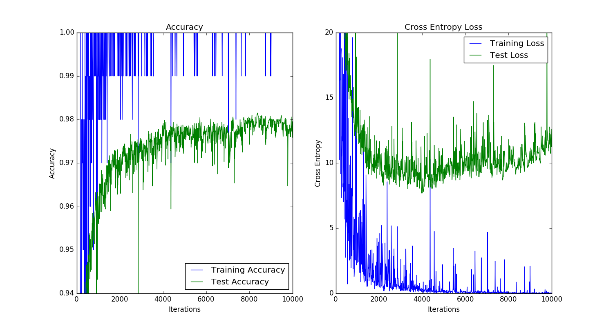
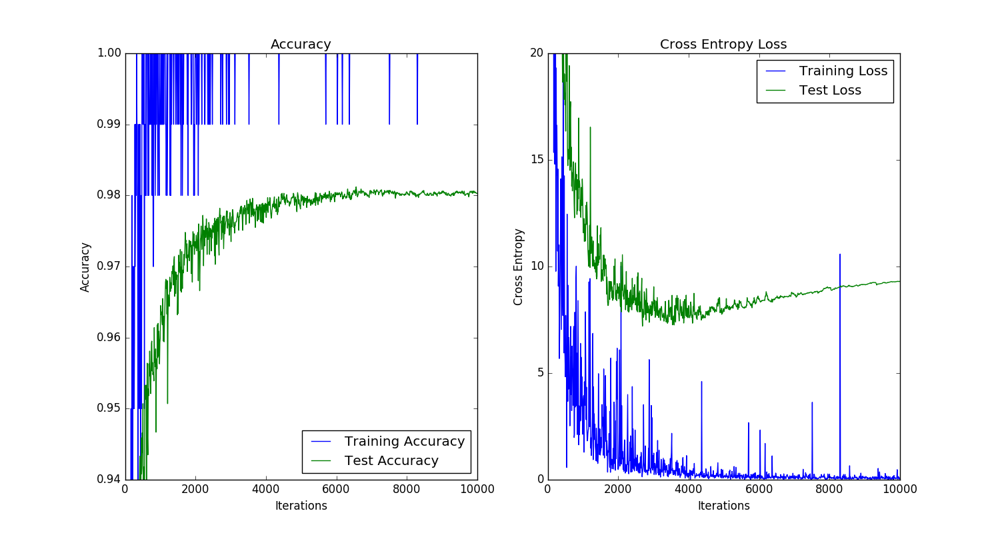
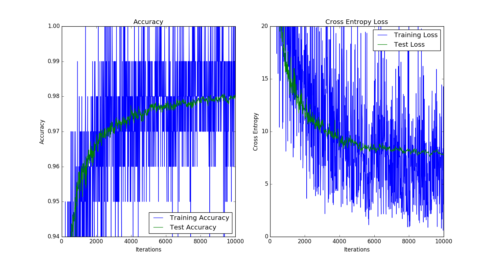
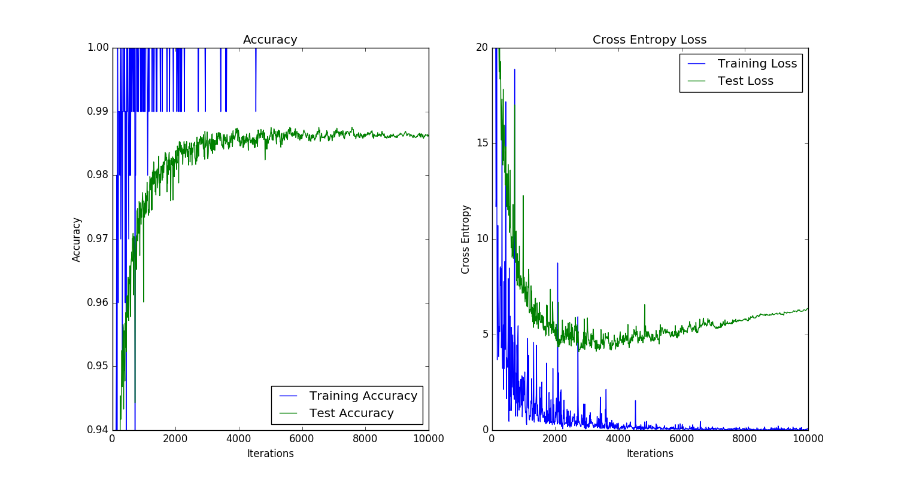
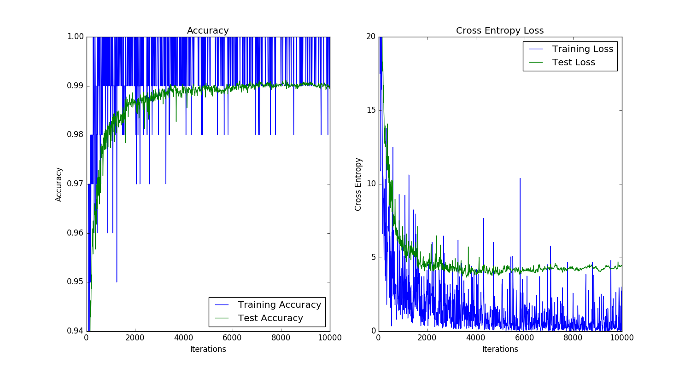
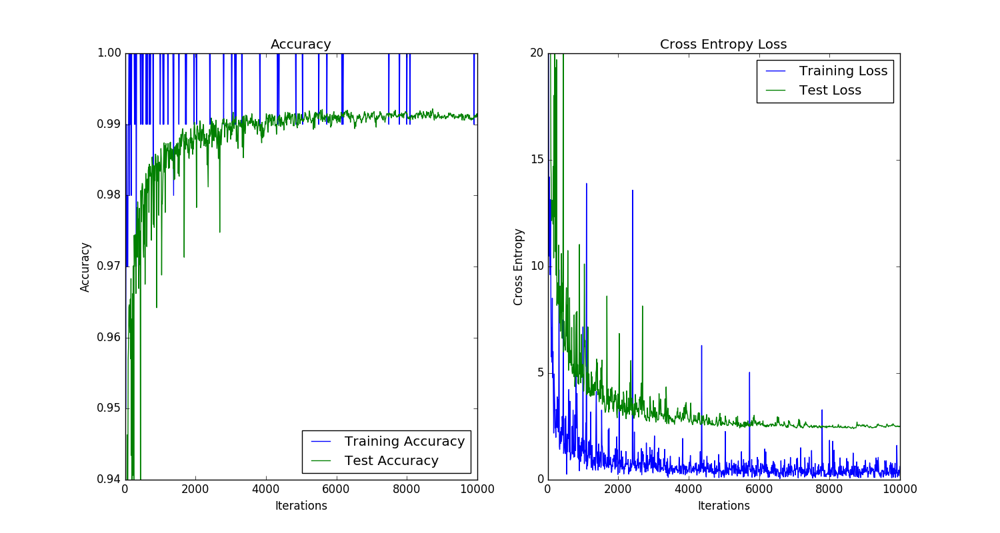
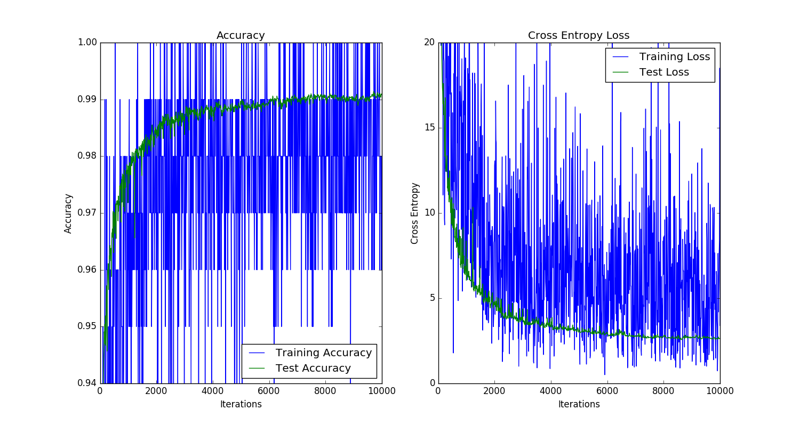

# Hello Tensorflow

These are some simple Tensorflow scripts I put together while listening to Martin Görner's talk, [Tensorflow and Deep Learning Without a PhD](https://www.youtube.com/watch?v=vq2nnJ4g6N0).

The [`scripts` directory](./scripts) contains the scripts and the [`output_images` directory](./output_images) contains training/test accuracy and cross entropy plots for each neural network.

## Notes about the various networks and outputs plots

### Simple neural network

The [simple neural network](./scripts/01_simple_neural_network.py) is straightforward but only achieves ~92% accuracy, poor performance for digit recognition on the MNIST dataset.

Max test accuracy achieved = 92.70%

### Deep network

The [deep network](./scripts/02_deep_network_simple.py) achieves better performance, getting closer to ~98% accuracy, but its performance is unstable.  This can be seen in the jagged test accuracy that never stabilizes.

Max test accuracy achieved = 98.15%

### Deep network with learning rate decay

[Decaying the learning rate](./scripts/03_deep_network_decay_learning_rate.py) helps stabilize model performance as seen in the test accuracy smoothing in later iterations of training.  However, this makes the overfit, seen in the increasing test cross entropy, more evident.

Max test accuracy achieved = 98.12%

### Deep network with learning rate decay and dropout

[Normalization via dropout](./scripts/04_deep_network_dropout.py) decreases the overfit, as seen in the stable test cross entropy, but does not increase performance.

Max test accuracy achieved = 98.08%

### Convolutional neural network

[Adding convolutions to the neural network](./scripts/05_convolutional_neural_network.py) helps recover the dimensions and shape of the data, increasing performance.  However, the overfit of test data, as seen in the increasing test cross entropy, returns.

Max test accuracy achieved = 98.75%

### Convolutional neural network with dropout

[Adding dropout to the convolutional neural network](./scripts/06_convolutional_neural_network_dropout.py) once again reduces overfit and even provides a slight performance boost.

Max test accuracy achieved = 99.12%

### Convolutional neural network with batch normalization

[Using batch normalization](./scripts/07_convolutional_neural_network_batch_normalization.py) gives another performance increase.

Max test accuracy achieved = 99.22%

### Convolutional neural network with batch normalization and dropout

[Using both batch normalization and dropout](./scripts/08_convolutional_neural_network_batch_normalization_dropout.py) doesn't seem to provide any benefit.

Max test accuracy achieved = 99.14%
